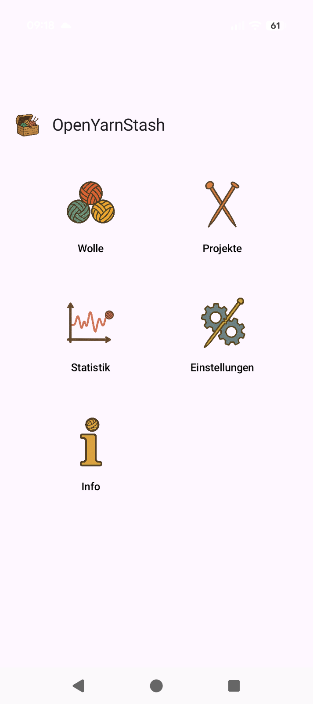

# OpenYarnStash

**OpenYarnStash** is an app for managing your yarn stash and knitting projects. It provides a clear overview of your inventory and projects, along with helpful statistics like yarn usage and completed projects over time.

This project is in early development, with more features planned. Feedback is always welcome, preferably via the [issue tracker](https://github.com/manfredscheucher/OpenYarnStash/issues) or via [email](mailto:OpenYarnStash@proton.me). Also let us know if you like the app! As an [open-source software](https://en.wikipedia.org/wiki/Open-source_software) project, you can explore the full source code, build it yourself, and you are welcome to contribute.

Built with [Kotlin Multiplatform](https://en.wikipedia.org/wiki/Kotlin_(programming_language)#Multiplatform) and [Compose Multiplatform](https://www.jetbrains.com/compose-multiplatform/), OpenYarnStash targets Android, iOS, Web, and desktop (Windows/macOS/Linux) from a single codebase with minimal platform-specific overhead.

Since we are only two developers, we decided to focus on the Android app for the initial phase. Other platforms may not be fully supported or could behave differently. We appreciate your understanding and encourage you to report any issues so we can address them.

## Support

If you’d like to support development financially, we may add options such as Ko-fi in the future. For now, starring the repository and sharing feedback are the best ways to help. Thank you very much!

## Getting Started

For platform-specific build and run instructions, please see **[BUILDING.md](./BUILDING.md)**.

