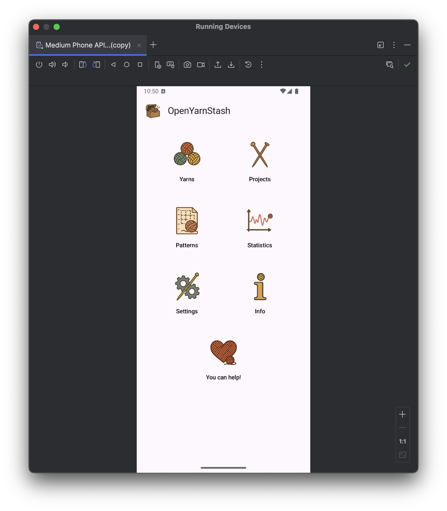
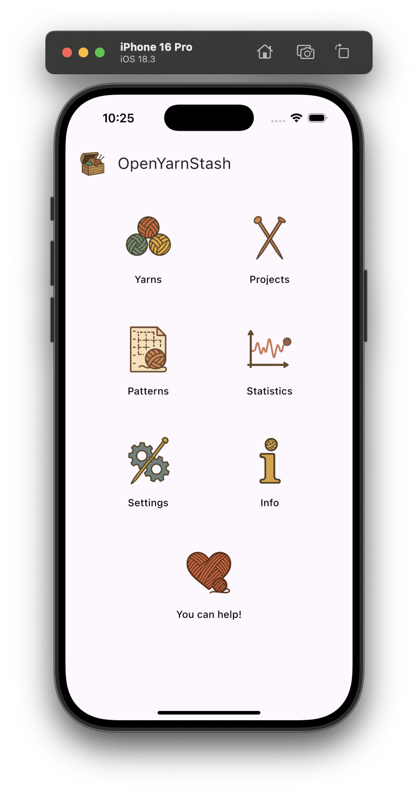
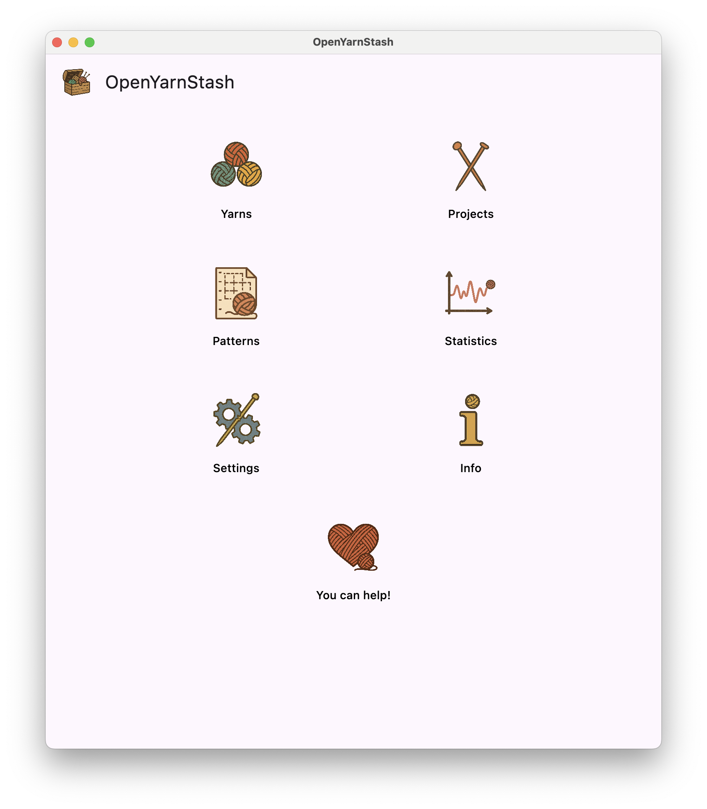

# OpenYarnStash

**OpenYarnStash** is an open-source app for managing your yarn stash and knitting/crochet projects. It provides a clear overview of your inventory and projects, along with helpful statistics like yarn usage and completed projects over time. All data is stored locally on your device, with manual export/import options.

As an [open-source software](https://en.wikipedia.org/wiki/Open-source_software) project released under the **MIT License**, you can explore the source code, build it yourself, and contribute. See the [LICENSE](LICENSE) file for details.

For a general-purpose inventory management system (not yarn-specific), check out our sister project [OpenFridge](https://github.com/manfredscheucher/OpenFridge).

## Features

- **Yarn Management**: Track yarn with details like brand, color, dye lot, weight, and meterage
- **Project Management**: Organize knitting/crochet projects with patterns, status, and yarn assignments
- **Pattern Library**: Store patterns with PDF support and thumbnails
- **PDF Export**: Export project details with yarn information as PDF
- **Statistics**: View monthly statistics showing yarn added and consumed over time
- **Image Support**: Add images to yarn, projects, and locations
- **Multi-language**: Support for English and German
- **Data Export/Import**: Export and import data as JSON or complete ZIP archives

## Development 

Built with [Kotlin Multiplatform](https://en.wikipedia.org/wiki/Kotlin_(programming_language)#Multiplatform) and [Compose Multiplatform](https://www.jetbrains.com/compose-multiplatform/), OpenYarnStash targets Android, iOS, Web, and desktop (Windows/macOS/Linux) from a single codebase.

This project was developed as an experiment in AI-assisted coding ("vibe coding"), comparing different AI models. Parts of the code were generated with **Claude Code** (Anthropic) and **Gemini** (Google). UI icons were created using **ChatGPT** prompts.

## How you can help

The project is in early development and any feedback is very welcome! Since we are only two developers, we focus on **Android** and **JVM desktop (Windows, Linux, macOS)** platforms. Other platforms may not yet be fully supported. We encourage you to report any issues so we can address them.

Also let us know if you like the app!

* Leave a star on our [GitHub repository](https://github.com/manfredscheucher/OpenYarnStash/)
* Use the [GitHub issue tracker](https://github.com/manfredscheucher/OpenYarnStash/issues) for reporting bugs/feature requests and discussing open tickets,
* Join [our Discord server](https://discord.gg/g2DpAXUX) for discussions
* Write us an [email](mailto:OpenYarnStash@proton.me)

